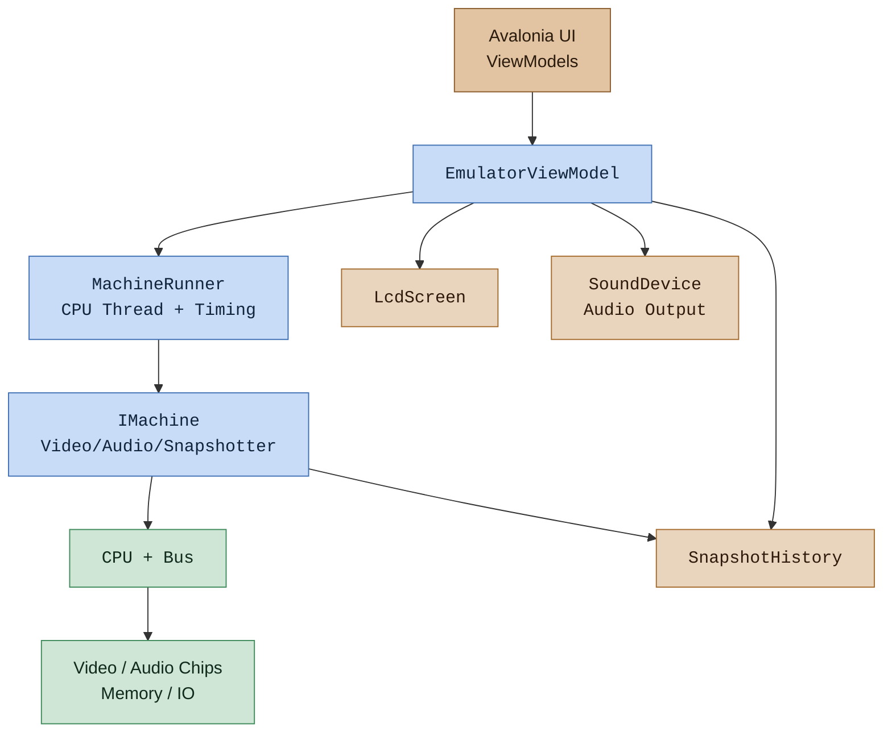

# DTC.Emulation

Shared emulator host and UI glue used by multiple systems (e.g., SMS and GB).
This repo was used to write each emulator listed below. Focuses on orchestration,
display handling, recording, and rollback while leaving hardware-specific devices
to per-system projects.

## Reference Emulator Projects

This library is used by two complete emulator implementations:

- **G33kBoy (Game Boy Emulator)** — https://github.com/deanthecoder/G33kBoy  
  Demonstrates LCD timing, cartridge mapping, save-state support, and integration with `DTC.Emulation`.

- **MasterG33k (Master System Emulator)** — https://github.com/deanthecoder/MasterG33k  
  Demonstrates VDP/PSG wiring, PAL/NTSC timing, debugger hooks, and how system-specific devices are structured around the core host.


## Architecture



## Key Types

- `MachineRunner`: Runs a machine on its own CPU thread and keeps emulated time in sync with real time.
- `EmulatorViewModel`: Common UI behavior for pause, screenshots, rollback, and recording.
- `LcdScreen`: Applies screen effects and exposes a `WriteableBitmap` for UI binding.
- `SnapshotHistory`: Periodic snapshots for rollback support.
- `RomLoader`: Shared ROM and zip entry loading.
- `RomNameHelper`: Consistent ROM display names + safe file base names.
- `AudioChannelSettings`: Per-channel enable tracking for audio sources.
- `SoundDevice`: OpenAL output device with capture support.
- `Memory`: Simple linear RAM device with snapshot helpers.
- `CpuBase` + `Bus`: Base types for CPU/bus wiring and debugger callbacks.
- Debuggers: `MemoryReadDebugger`, `MemoryWriteDebugger`, `PcBreakpointDebugger`.

## Basic Setup

1. Build a machine that implements `IMachine` and provide an audio output device.
2. Create a descriptor (`IMachineDescriptor`) that defines timing and display geometry.
3. Create a `MachineRunner` and an `EmulatorViewModel`.
4. Bind `EmulatorViewModel.Display` to your UI image control.
5. Wire UI commands to the view model methods.

## Machine Wiring (CPU/Bus/Devices)

`DTC.Emulation` does not create CPUs or full buses; that stays in each system project.
Your system project builds a concrete `IMachine` that wires CPU, bus, PPU/VDP,
APU/PSG, memory, ports, and input together. `Memory` and `Bus` are provided
as reusable building blocks.

Typical structure:

1. Construct the hardware devices (PPU, APU, memory controller, input, etc).
2. Create the bus and attach memory devices / mappers.
3. Create the CPU using the bus.
4. Implement `IMachine` to expose:
   - `Video` (IVideoSource), `Audio` (IAudioSource)
   - `StepCpu()`, `AdvanceDevices(deltaTicks)`
   - Snapshotter and ROM loading

SMS example (simplified):

```csharp
var vdp = new SmsVdp();
var joypad = new SmsJoypad();
var memory = new SmsMemoryController();
var psg = new SmsPsg(audioDevice, descriptor.CpuHz, descriptor.AudioSampleRateHz);
var portDevice = new SmsPortDevice(vdp, joypad, memory, psg);
var cpu = new Cpu(new Bus(new Memory(), portDevice));
cpu.Bus.Attach(new SmsRamMirrorDevice(cpu.MainMemory));
cpu.Bus.Attach(memory);

var machine = new SmsMachine(descriptor, audioDevice); // wraps the above wiring
```

## Descriptor Creation

`IMachineDescriptor` carries timing and display metadata. You typically create it
in the UI layer (or settings layer) so PAL/NTSC changes can update CPU/video rates:

```csharp
var cpuHz = isPal ? 3_546_895 : 3_579_545;
var videoHz = cpuHz / (SmsVdp.CyclesPerScanline * vdp.TotalScanlines);
var descriptor = new MachineDescriptor
{
    Name = "MasterG33k",
    CpuHz = cpuHz,
    VideoHz = videoHz,
    AudioSampleRateHz = 44100,
    FrameWidth = SmsVdp.FrameWidth,
    FrameHeight = SmsVdp.FrameHeight
};
```

## Debuggers

`CpuBase` supports debugger callbacks (in Debug builds) through `ICpuDebugger`.
Attach a debugger via `CpuBase.AddDebugger(...)`.

Example:

```csharp
cpu.AddDebugger(new MemoryReadDebugger(0xC000, value => Logger.Instance.Info($"Read {value:X2}")));
cpu.AddDebugger(new MemoryWriteDebugger(0xFFFC, 0x03, _ => Logger.Instance.Info("Mapper bank changed.")));
cpu.AddDebugger(new PcBreakpointDebugger(0x1234, () => Logger.Instance.Info("Hit breakpoint.")));
```

For Z80-specific helper debuggers (e.g., the incrementing counter detector),
see `DTC.Z80/Debuggers`.

## Minimal Example

```csharp
var screen = new LcdScreen(frameWidth, frameHeight);
var audio = new SoundDevice(44100);
var machine = new MyMachine(descriptor, audio);
var runner = new MachineRunner(machine, () => descriptor.CpuHz, e => Logger.Instance.Error(e.Message));

var emulator = new EmulatorViewModel(
    machine,
    runner,
    audio,
    screen,
    () => descriptor.VideoHz,
    () => currentRomTitle,
    () => descriptor.CpuHz);

// Bind emulator.Display and call emulator.Start(), emulator.TogglePause(), etc.
```

## UI Helpers

- `UI.RollbackDialog`: DialogHost content for previewing/restoring snapshots.
- `UI.RomFileToNameConverter`: MRU-friendly ROM name display.

## Notes

- `Bus` sizes itself from the main memory address range.
- OpenAL is used for audio output (`OpenTK.Audio.OpenAL` package).
